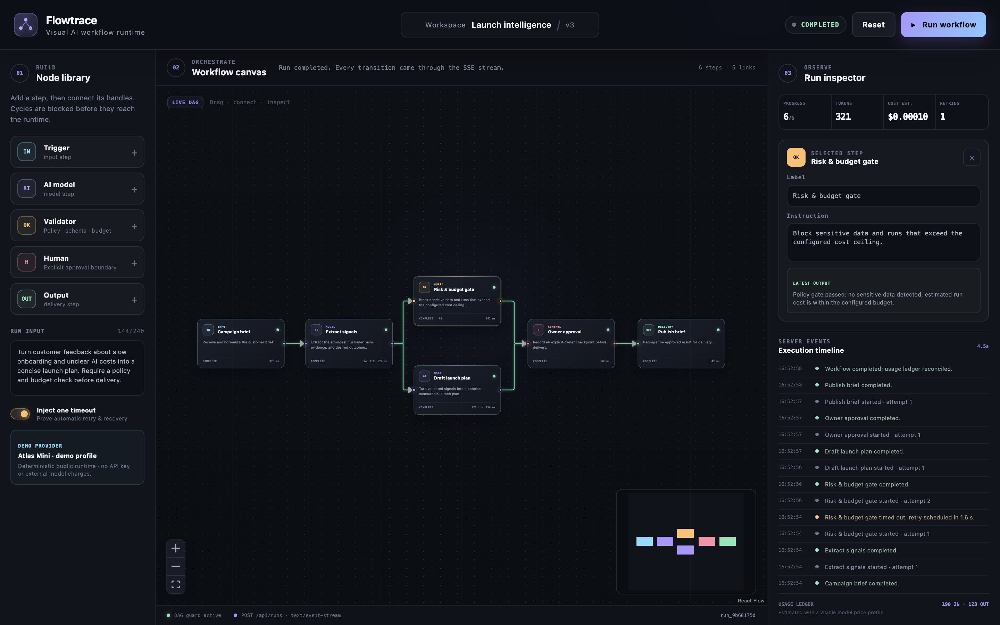

# Flowtrace

Flowtrace is a compact visual workflow runtime built as a portfolio demo for node-based AI product work. It shows the difficult parts that usually sit behind a workflow canvas: graph validation, streaming execution state, recoverable failures, and a transparent usage ledger.

- Live demo: https://flowtrace-workflow.vercel.app
- Source: https://github.com/guoruncheng-web/flowtrace



## What can be verified

- Drag the six starter nodes and connect their handles on a React Flow canvas.
- Add model, validation, approval, input, and output steps from the node library.
- Edit a selected step's label and instruction or delete it.
- Try to create a loop: the client blocks it, and the server validates the DAG again.
- Run the graph through `POST /api/runs` and observe actual `text/event-stream` events.
- Leave **Inject one timeout** enabled to watch the validation step fail, back off for 1.6 seconds, and recover on attempt two.
- Inspect per-node output, duration, attempt count, input/output tokens, and estimated cost.
- Stop an active stream with `AbortController` or reset the starter graph.

## Runtime design

```text
React Flow canvas
       │ graph + brief
       ▼
POST /api/runs ── validate DAG ── topological execution
       │                                  │
       │ text/event-stream                ├─ retry/backoff
       ▼                                  └─ usage ledger
node state + timeline + cost metrics
```

The included provider is deliberately deterministic and public-safe. It derives output from the current brief and upstream results, so every run uses the graph the visitor submits, but it does not call a paid external model. A typed `WorkflowProvider` boundary in `lib/provider.ts` is the integration seam for a production model gateway. The displayed `Atlas Mini · demo profile` rates are explicitly labeled as a demo price profile.

## Stack

- Next.js 15, React 19, and TypeScript
- React Flow (`@xyflow/react`) for node editing
- Web `ReadableStream` and Server-Sent Events for execution updates
- Vitest for graph, metering, and provider tests
- Vercel-compatible standalone production build

## Run locally

```bash
pnpm install
pnpm dev
```

Open `http://localhost:3000`. To verify the project:

```bash
pnpm test
pnpm typecheck
pnpm build
```

## What it deliberately does not do

- No authentication, persistence, collaboration, or production job queue.
- No paid model call or hidden API key in the public demo.
- No claim that browser cancellation can replace a durable worker cancellation protocol.
- No fabricated business KPIs; displayed metrics come from the current run.

Those are intentional portfolio boundaries rather than partially implemented product features.
